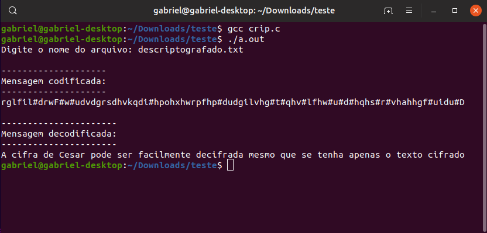

# Criptografia-Cesar

****
**Criptografia Baseada na criptografia de César**
O projeto contém dois arquivos feitos em C, um para a criptografia da mensagem escrita em um arquivo, e o outro para a descriptografia da mensagem, e dois arquivos .txt para exemplo.

 

